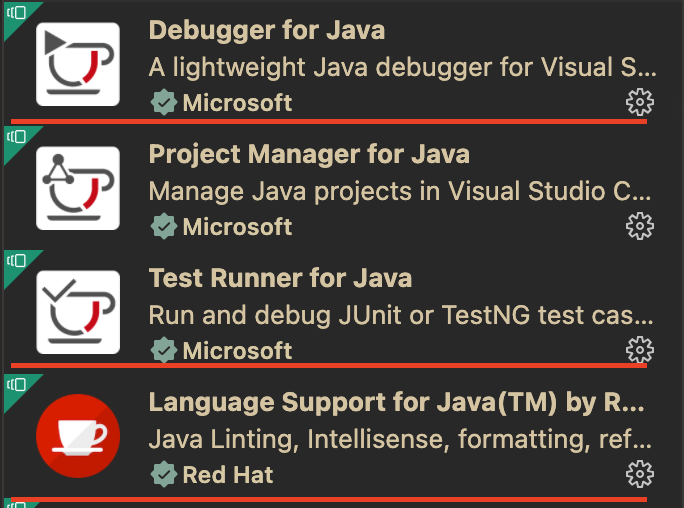
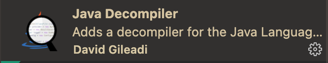

# NVIM 打造 Java IDE

[JavaHello/nvim](https://github.com/JavaHello/nvim/tree/nvim-lsp)

## `Java`开发环境配置

- 安装 `jdk11 +`配置好环境变量
  ```sh
  # Java runtimes
  export JAVA_8_HOME=/path/jdk8 # default
  export JAVA_11_HOME=/path/jdk11
  export JAVA_17_HOME=/path/jdk17
  export JAVA_HOME=$JAVA_17_HOME
  ```
- 安装 `maven` 配置好环境变量
  ```sh
  # Maven
  export MAVEN_HOME=/path/maven
  ```
- 安装 `gradle` 可选
- 安装 `vscode` 相关 `Java` 扩展包
  
  
- 安装 `lombok` 相关 `Java` 扩展包, 配置环境变量

  ```sh
  # lombok jar
  export LOMBOK_JAR=/path/lombok.jar
  ```

- 配置 `jdt.ls` server (可选)
  ```sh
  # jdt.ls 的 路径，默认使用 vscode-java 扩展
  # 推荐自己 clone 代码编译
  export JDTLS_HOME=/path/jdt.ls
  ```
- 配置 `jdt.ls` 启动 `java`(可选)

  ```sh
  # 用于启动 jdt.ls 的 java 环境
  # 推荐使用 jdk17, 默认使用 JAVA_HOME
  export JDTLS_RUN_JAVA=${JAVA_17_HOME}/bin/java
  ```

- 打开 `Java` 工程测试
